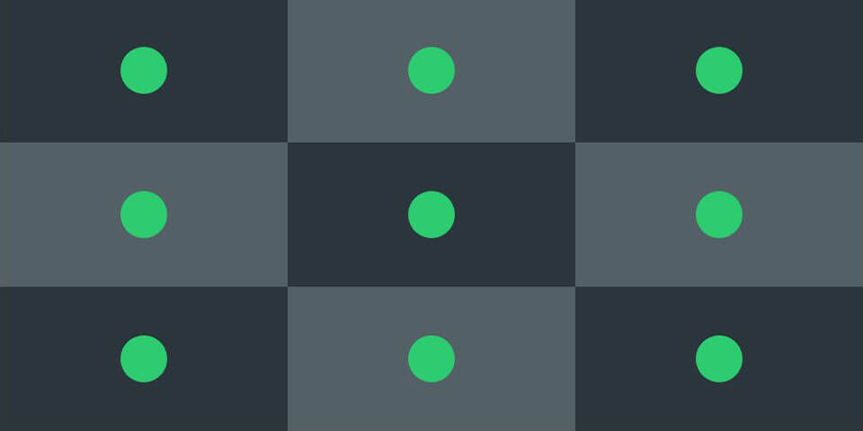
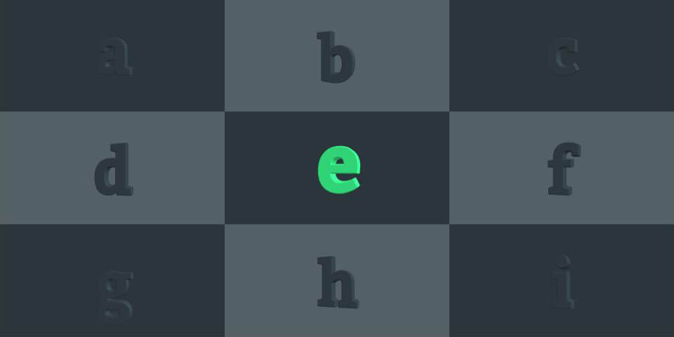

# _Back to the Future: The Marriage of React and Three.js_

Running multiple instances of Three.js (or [HTML5 Canvas][HTML5 Canvas] elements if you're more familiar that term) can get rather heavy for our sweet little processors. Luckily there's a better way when all you want to do is render multiple views of different objects side by side on the same page! Also as an added bonus, tonight we'll be looking at how to marry [React][React] and Three.js together without getting [a massive headache][Wat]...

## **Create React App**
Seems like the title gave it all up! There's various boilerplates and other manual ways of getting started with React, but the easiest way is by using [create-react-app script][create-react-app] developed by none other than **Facebook**.

All we need to do is install the script and run it! The `-g` flag stands for a global install.
```bash
npm install -g create-react-app
create-react-app react-threejs-project
```

### Quick Housekeeping
Running the script already takes us half way there and we're ready to start customising the project. The core component at `./src/App.js` is the first to be modified. It can stay mostly as it is, all we want to change is to render our View component instead.

```javascript{}
import View from "./components/View";

<div className="App">
  <View id="viewContainer" />
</div>
```
### Summoning Our Magic Window
The first hints of **black magic** are starting to appear at our View component. Graphics is not a React component, but a JavaScript class! Which means that all of our Three.js code is being run outside of React components.
```javascript{5-7}
import React, { Component } from "react";
import Graphics from "./Graphics";

export default class View extends Component {
  componentDidMount() {
    this.app = new Graphics(this.props);
  }

  render() {
    return <div className="view" id={this.props.id} />;
  }
}
```

### What Happens in Three.js...
Below is the minimal version of our `Graphics.js`, which will be where we bring together everything related to 3D in this project. For now all we're doing is initiating the scene and starting animation with [requestAnimationFrame][requestAnimationFrame]. Another great option for controlling FPS (the heartbeat of our animation) is [TweenMax][TweenMax]!
```javascript{5-9}
import SceneObj from "./Scene";

export default class Graphics {
  constructor(props) {
    // Getting the container created in View and creating a scene
    this.container = document.getElementById(props.id);
    this.scene = new SceneObj({
      container: this.container
    });

    this.animate();
  }

  animate() {
    // Repeatedly calling animate() and render() from SceneObj
    requestAnimationFrame(this.animate.bind(this));
    this.scene.render();
  }
}
```

### ...Stays in Three.js!
To make life complicated there's always many ways of doing simple tasks. Here we see two ways of importing functions from Three.js library. We can either manually request the one's we need or request all of them at once! The only difference in use will be writing `new THREE.Scene()` rather than `new Scene()` when using **the wildcard** `*`
```javascript{}
// Import with this
import { Scene, WebGLRenderer, PerspectiveCamera } from "three";
// Or this
import * as THREE from "three";

export default class SceneObj extends Scene {
  constructor(options) {
    super();

    // Create and setup renderer & camera
    this.renderer = new WebGLRenderer();
    this.renderer.setSize(window.innerWidth, window.innerHeight);
    this.camera = new PerspectiveCamera(45, window.innerWidth / window.innerHeight), 1, 10000);

    // And then append it to DOM
    options.container.appendChild(this.renderer.domElement);
  }

  render() {
    // This renders the graphics on canvas
    this.renderer.render(this, this.camera);
  }
}
```

## **Where's My Multiple Views Though...?**
But hold on we wanted more than one view, like [a windowpane][windowpane]! Let's head back to `App.js` for initial data setup. In this example the data is static but it could be coming from a server to be dynamic just as well! The data is generated in the constructor and then passed in to the [React State][React State]. From there our component can access it through [props][React Props]!

```javascript{13-21}
// How many views in each side
const viewSideCount = 3;
const viewPow2 = Math.pow(viewSideCount, 2);
// And the space between each one
const size = 1 / viewSideCount;

const viewArray = [];
// Data for each view
for (let i = 0; i < viewPow2; i++) {
  // Calculate the offset for each view
  const xCoord = i % viewSideCount;
  const yCoord = Math.floor(i / viewSideCount);
  const view = {
    left: xCoord * size,
    top: yCoord * size,
    width: size,
    height: size,
    // Offset for each different object
    pos: [i * 1000, 0, 75],
    background: i % 2 === 0 ? "#2a363b" : "#536065"
  };
  viewArray.push(view);
}

// Passing the data from state to component props
<View id="viewContainer" views={viewArray} viewCount={viewPow2} />
```

Just a tiny bit more of black magic and we have an ugly **but** working prototype on our hands! `Scene.js` is where the majority of changes take place. For every view we'll be creating a new camera, luckily they're dirt cheap compared to [the real ones!][Camera Rig] Then rather than calling `renderer.render()` only once, no surprises here, we call it for every view. But because we don't want to render the same image multiple times we need to update some [parameters][Three.js Scissor] each time!
```javascript{17-21}
for (let i = 0; i < options.viewCount; i++) {
  const view = options.views[i];
  const camera = new PerspectiveCamera(options.camera.fov, this.width / this.height, 1, 10000);
  camera.position.fromArray(view.pos);
  view.camera = camera;
}

render() {
  for (let i = 0; i < this.options.viewCount; i++) {
    const view = this.options.views[i];

    const left = Math.floor(this.width * view.left);
    const top = Math.floor(this.height * view.top);
    const width = Math.floor(this.width * view.width);
    const height = Math.floor(this.height * view.height);

    // The important functions are called here
    // Sets which area on canvas to fill and turn other areas transparent
    this.renderer.setViewport(left, top, width, height);
    this.renderer.setScissor(left, top, width, height);
    this.renderer.setScissorTest(true);

    // Possible to also change background color
    this.renderer.setClearColor(new Color(view.background));

    // Remember to switch the camera to get a different viewpoint
    this.renderer.render(this, view.camera);
  }
}
```

### Finally Some Results!
All our hard work has paid off and we've got something on the canvas. It looked a bit too much like a checkerboard before I added some beautiful spheres in the scene. One thing to remember is we're not rendering one sphere, but multiple different spheres which have been offset in the same fashion as our cameras!



At this point we're done with the technicalities but... it looks a bit dull. **Let's fix that!**

## **Done, but...**
### Let's Fix Colors
This step is already done! However here's couple of links for generating a pleasent looking color schemes quickly. First of I usually pick one or two colors from [Flat UI][FlatUIColors]. Then bring those color values over to [Material Design Color Tool][Material Design Color Tool] to get complimenting shades and font information!

### Let's Fix Fonts
Looking at perfectly round spheres gets boring so I thought 3D alphabets would fit this procedural example perfectly. Three.js has built in [TextGeometry][TextGeometry] which takes care of all the heavy lifting. Also it's really easy to use any custom fonts with it by first loading eg. from [Google Fonts][Google Fonts] and then converting it to *.json* file with [Facetype.js][Facetype.js].

You can then load the font in `./src/components/Graphics.js` and generate geometry from it!

```javascript{3-4}
const loader = new FontLoader();
loader.load("../fonts/Bitter_Bold.json", font => {
  // The easiest way for making font global
  window.font = font;
  _this.initMeshes();
});

initMeshes() {
  const views = this.props.views;
  this.letterArray = [];
  // For every view generate an alphabet
  for (let i = 0; i < this.props.viewCount; i++) {
    // view contains the data
    const view = views[i];
    const text = new Text(view);
    this.scene.add(text);
  }
}
```
And in `./src/components/Text.js`

```javascript{8}
export default class Text extends THREE.Object3D {
  constructor(props) {
    super();

    // props.text comes from App.js
    // -> text: String.fromCharCode(65 + (i % 26)).toLowerCase()
    const textGeo = new THREE.TextGeometry(props.text, {
      font: window.font,
      size: 25,
      height: 5,
    });

    const texMat = new THREE.MeshLambertMaterial({ color: 0x2a363b });
    const textMesh = new THREE.Mesh(textGeo, texMat));
    this.add(textMesh);
  }
}
```

*I can already see how useful this is for [learning alphabets!][Learn Alphabets]*


## **Highlight, Rotate, Dynamic**
To make things visually bit more interesting I've added **setInterval()** to highlight one letter at a time. By changing the value `viewSideCount` we're able to quickly generate a new canvas which is filled by desired amount of letters!

<div style="overflow: hidden">
<video style="width: 100%" playsinline autoplay loop muted class="responsive">
  <source type="video/mp4" src="./media/alphabets-dynamic.mp4"></source>
  <p>Your browser does not support the video element.</p>
</video>
</div>

[HTML5 Canvas]: https://www.w3schools.com/html/html5_canvas.asp
[React]: https://reactjs.org/
[Wat]: https://www.destroyallsoftware.com/talks/wat
[create-react-app]: https://facebook.github.io/create-react-app/
[requestAnimationFrame]: https://developer.mozilla.org/en-US/docs/Web/API/window/requestAnimationFrame
[TweenMax]: https://greensock.com/tweenmax
[windowpane]: https://goo.gl/8GMKeT
[React State]: https://reactjs.org/docs/state-and-lifecycle.html
[React Props]: https://reactjs.org/docs/components-and-props.html
[Camera Rig]: http://www.mammothhd.com/Press/Panavision-8Epic-rig.jpg
[Three.js Scissor]: https://threejs.org/docs/#api/en/renderers/WebGLRenderer.setScissor
[FlatUIColors]: https://flatuicolors.com/palette/defo
[Material Design Color Tool]: https://material.io/tools/color
[TextGeometry]: https://threejs.org/docs/#api/en/geometries/TextGeometry
[Learn Alphabets]: https://www.youtube.com/watch?v=KBPAI6qLW5o
[Google Fonts]: https://fonts.google.com/
[Facetype.js]: http://gero3.github.io/facetype.js/