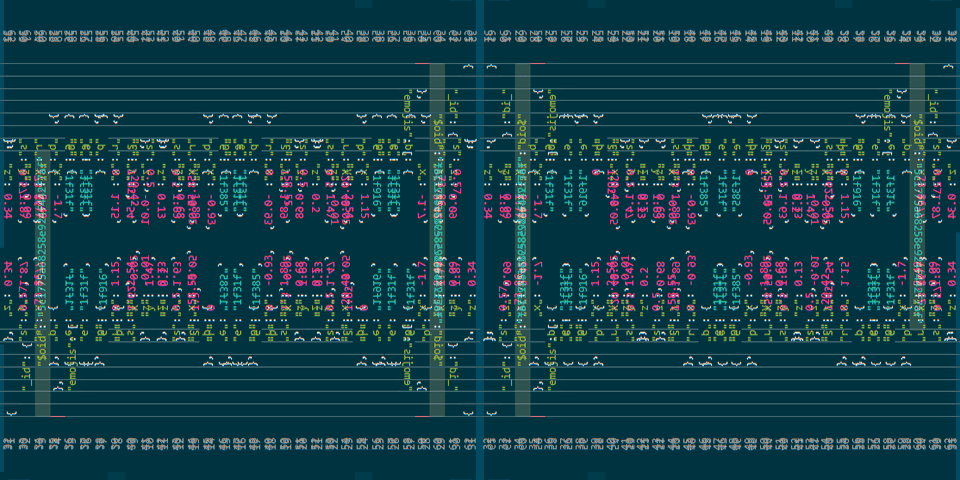
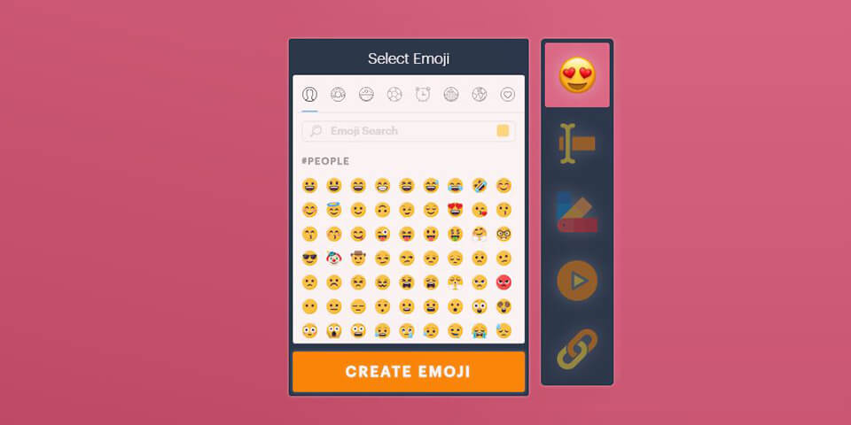

# _101 Database Entries_
Sharing computer graphics driven experiences online isn't exactly a walk in the park. In offline non-realtime programs having [a point cloud of 30 gigabytes][Potree] in size could be normal. But, that's not workable for a web application, especially one running over a weak 3G signal. Below, I've listed a few ways to increase the performance of our apps to keep the users happy!



The example codes are from my latest personal project called [Popup Mockup][Popup Mockup]. It is a virtual pop-up card generator. While planning for the project, I made some decisions on the design which avoids some of the biggest pitfalls!

## **Geometries**
All the geometry in Popup Mockup is created from simple [primitives][primitives], in this case, planes and boxes. If possible, avoiding loading large chunks of geometry or at very least optimizing them is important! 

### Don't Save Everything, Recreate
When saving the generated scene to a [database][database], the naive approach would be to store information of each object. It's better to focus on important objects which are the building blocks of the scene. Then we can save a minimal amount of information while being able to recreate the scene. In this study case, I needed the matrix coordinates of each emoji and text element (position, rotation and scale).


_Example entry in the database for a card with only one emoji element:_
```javascript{4-11}
{ "emojis": [
  {
    // Also the emoji texture name
    "e": "1f600",
    "p": {
        "x": 0.29,
        "y": 1.51,
        "z": 0.74
    },
    "s": 1.27,
    "r": -28.04
  }  
]}
```

 When loading the page we can identify if the user is creating a new card or loading a shared one based on `window.location.pathname`. Both imported components are similar but in `ShareCardApp` the user won't be able to create anything new. The scene is recreated based on the information fetched from the database.

```javascript{1-2,20-24}
import BuildCardApp from "./BuildCardApp";
import ShareCardApp from "./ShareCardApp";

const pathName = window.location.pathname.split("/");
const shortId = pathName.pop();
const apiUrl = pathName.pop();

if (shortId && apiUrl === "share") {
  axios
    .get(`/api/${shortId}`)
    .then(response => {
      // If the queried card entry is found in database, use ShareCardApp component
      if (response.data) this.setState({ mode: "share" });
    })
} else {
  // Else open the blank card editor
  this.setState({ mode: "build" });
}

if (mode === "share") {
  renderMode = <ShareCardApp />;
} else {
  renderMode = <BuildCardApp />;
}
```

## **Ease on the Precision Pedal**
Below is a self-explanatory example of how each card element is saved. Do note all the times I've used `.toFixedNumber(2)` to get rid of extra [precision][precision] which was not needed!

```javascript{8-17,20-31}
allElements.forEach((cardEl) => {
  const pos = cardEl.getAttribute("position");
  const scale = cardEl.getAttribute("scale");
  const rotation = cardEl.getAttribute("rotation");

  // Slightly different database inputs for emoji and text elements
  if (cardEl.getAttribute("id").includes("emoji")) {
    const emojiData = {
      e: cardEl.emoji,
      p: {
        x: pos.x.toFixedNumber(2),
        y: pos.y.toFixedNumber(2),
        z: pos.z.toFixedNumber(2)
      },
      s: scale.x.toFixedNumber(2),
      r: rotation.z.toFixedNumber(2)
    };
    emojiArray.push(emojiData);
  } else {
    const textData = {
      t: child.text,
      f: child.font,
      c: child.bgColor,
      p: {
        x: pos.x.toFixedNumber(2),
        y: pos.y.toFixedNumber(2),
        z: pos.z.toFixedNumber(2)
      },
      s: scale.x.toFixedNumber(2),
      r: rotation.z.toFixedNumber(2)
    };
    textArray.push(textData);
  }
});
```

## **Using CDN for resources**
At first, I wanted to give an option to upload own images for textures but realized the storage issues involved. To save all the images wouldn't be free or even cheap! I found out a [library for returning emoji images][emoji-js] based on a string id and figured it would be good solution. Using only emojis as an input ended up being a fun gag, but also will save a tremendous amount of storage space on my end. So the lesson learned here is to use external [CDNs][cdn] and [APIs][api] for getting data in if possible!

_Implementing the texture selection library to the UI:_


[Potree]: http://www.potree.org/potree/examples/showcase/retz.html
[Popup Mockup]: https://popupmockup.com/share/helloworld
[primitives]: https://www.instructables.com/id/The-Basics/
[database]: https://mlab.com/
[precision]: http://fabiensanglard.net/floating_point_visually_explained/
[emoji-js]: https://github.com/iamcal/js-emoji
[cdn]: https://en.wikipedia.org/wiki/Content_delivery_network
[api]: https://en.wikipedia.org/wiki/Application_programming_interface